# Artifact Manager on S3 plugin

Artifact Manager on S3 plugin is an Artifact Manager that allow you to store your artifacts into a S3 Bucket on Amazon.
The use of this S3 Bucket as a artifact storage is transparent to Jenkins and your jobs, it works like the default 
Artifact Manager.

Artifact manager implementation for Amazon S3, currently using the jClouds library.
[wiki](https://wiki.jenkins.io/display/JENKINS/Artifact+Manager+S3+Plugin)

# Prerequisites

First of all, you will need a Amazon account, this Amazon account should have permissions over the S3 Bucket that 
you want to use as artifact storage.

The plugin is expected to run with a IAM profile and the S3 bucket must be already created.
When running in AWS that means the instance needs to have
an IAM role set with a policy that allows access to the S3 bucket to be used.

This is an example policy

```json
{
    "Version": "2012-10-17",
    "Statement": [
        {
            "Sid": "AllowListingOfFolder",
            "Effect": "Allow",
            "Action": "s3:ListBucket",
            "Resource": "arn:aws:s3:::my-bucket-name",
            "Condition": {
                "StringLike": {
                    "s3:prefix": "some/path/*"
                }
            }
        },
        {
            "Sid": "AllowS3ActionsInFolder",
            "Effect": "Allow",
            "Action": [
                "s3:PutObject",
                "s3:GetObject",
                "s3:DeleteObject",
                "s3:ListObjects"
            ],
            "Resource": "arn:aws:s3:::my-bucket-name/some/path/*"
        }
    ]
}
```

# Configuration

In order to configure the plugin on Jenkins, you have to go to Manage Jenkins/Configure System to 
the `Artifact Management for Builds` section, there you have to select the Cloud Provider `Amazon S3`.

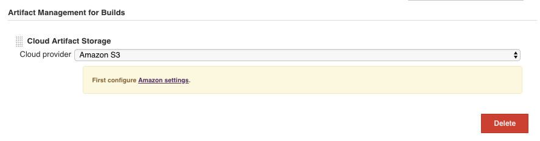

Then you have to configure your credentials to access the AWS services, go to Manage Jenkins/Amazon Web Services Configuration,
there you can configure the Region and the Amazon Credentials to use, you have to save or apply this setting before to continue.
For more details check [AWS Credentials](#aws-credentials)

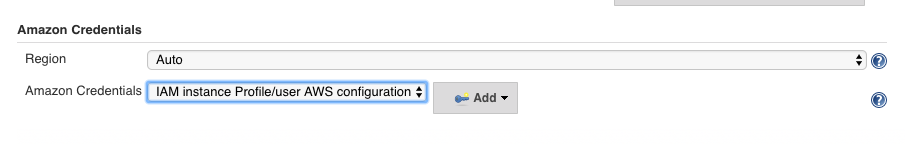

* S3 Bucket Region: Region to use to generate the URLs to get/put artifacts, by default it is autodetected.

After that you can configure the S3 Bucket settings on Manage Jenkins/Amazon Web Services Configuration on the section `Amazon S3 Bucket Access settings` in 
the same configuration page.

* S3 Bucket Name: Name of the S3 Bucket to use to store artifacts.
* Base Prefix: Prefix to use for files and folders inside the S3 Bucket, if the prefix is a folder should be end with `/`.
* Delete Artifacts: Delete artifacts from S3 when a build is deleted, this option is controlled by a java property see [Delete Artifacts](#delete-artifacts)
* Delete Stashes: Delete stashes from S3 when a build is deleted, this option is controlled by a java property see [Delete Stash](#delete-stash)
* Custom Endpoint: Custom host and port (e.g. minio.myorg.org:9000) for the S3 client to connect to. This is typically used when using an S3 compatible provider (e.g. Azure, Google Cloud, minio) and not AWS S3.
* Custom Signing Region: Only used when a Custom Endpoint is specified ('us-east-1' is used if it is blank).
* Use Path Style URL: When this option is enabled URLs are formatted https://endpoint/bucket/key (path style) and when this option is disabled URLs are formatted as https://bucket.endpoint/key (virtual hosting style).
* Use Insecure HTTP: Use URLs with the http protocol instead of the https protocol.
* Use Transfer Acceleration: Use [S3 Transfer Acceleration](https://docs.aws.amazon.com/AmazonS3/latest/dev/transfer-acceleration.html)
* Disable Session Token: When this option is enabled the plugin won't contact AWS for a session token and will just use the access key and secret key as configured by the Amazon Credentials plugin.

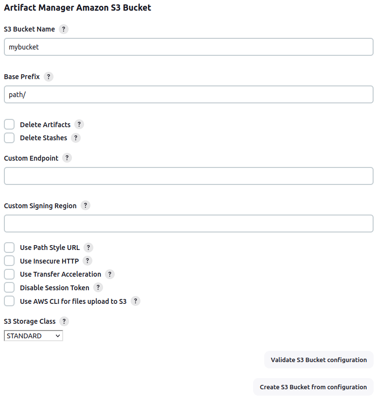

Every field on the configuration form has a validation, this validation will check that the field value is a proper value.

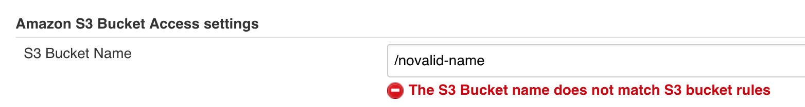

If you save a wrong configuration, you will see a related error explained why, then you have to came back to 
the configuration page to set the proper value.

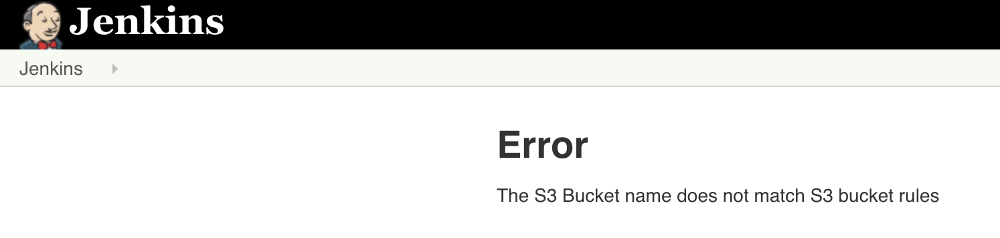 

Before saving the configuration, we recommend you to test the configuration by using the "Validate S3 Bucket configuration" 
button. This button will test the bucket exists and the credentials used are valid and has access to the bucket. 
See the [troubleshooting section](#troubleshooting) for more details about the reported error. 

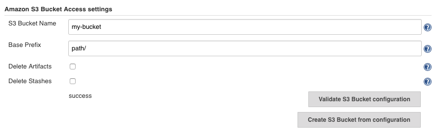

If you're using a non AWS S3 service, you will need to use a custom endpoint, use path style URLs and disable session tokens.  We recommend you consult the documentation of the service for the requirements

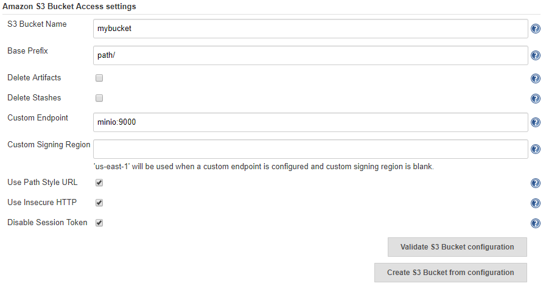

For Google Cloud Storage:

* the AWS Credentials need to correspond to a Google Service Account HMAC key (Access ID / Secret) - See [this documentation](https://cloud.google.com/storage/docs/authentication/hmackeys)
* the custom endpoint is `storage.googleapis.com`

Finally the "Create S3 Bucket from configuration" button allow you to create the bucket if it does not exist 
and the AWS credentials configured have permission to create a S3 Bucket.

# How to use  Artifact Manager on S3 plugin

Artifact Manager on S3 plugin is transparently used by the Jenkins Artifact system, so as other Artifacts Managers, 
you only have to use the Artifact Step to archive/unarchive, and the stash/unstash step, let's see how it works. 
We have also to mention here, the [Copy Artifacts plugin](https://plugins.jenkins.io/copyartifact) that allow you 
to download artifacts from a finished build.

## Pipeline job

Artifact Manager on S3 plugin can be use in a [Pipeline](https://jenkins.io/doc/book/pipeline/) job, 
you have to use the `archiveArtifacts` step to archive artifacts in the S3 Bucket, for more details you can check 
the [archiveArtifacts step documentation](https://jenkins.io/doc/pipeline/steps/core/#archiveartifacts-archive-the-artifacts)

```
node() {
    //you build stuff
    //...
    stage('Archive') {
        archiveArtifacts "my-artifacts-pattern/*"
    }
}
```

for unarchive artifacts you have to use the `unarchive` step that will retrieve the artifacts from S3 Bucket, 
the mapping parameter is list of pairs `source-filename` `destination-filename`, for more details you can check 
the [unarchive step documentation](https://jenkins.io/doc/pipeline/steps/workflow-basic-steps/#code-unarchive-code-copy-archived-artifacts-into-the-workspace)

```
node() {
    //you build stuff
    //...
    stage('Unarchive') {
        unarchive mapping: ["my-artifacts-pattern/": '.']
    }
}
```

to save a set of files for use later in the same build, generally on another node/workspace, 
you can use [stash](https://jenkins.io/doc/pipeline/steps/workflow-basic-steps/#stash-stash-some-files-to-be-used-later-in-the-build),
`stash` step will store those files on the S3 Bucket for later use.

```
node() {
    //you build stuff
    //...
    stash name: 'stuff', includes: '*'
}
```

to retrieve those files saved with the `stash` step you have to use the [unstash](https://jenkins.io/doc/pipeline/steps/workflow-basic-steps/#unstash-restore-files-previously-stashed)
step, `unstash` will retrieve the files from the S3 Bucket to the local workspace. 

```
node() {
    //you build stuff
    //...
    unstash 'stuff'
}
```

## FreeStyle job

On FreeStyle jobs, you can archive artifacts by using a `Post-build Action` of type `Archive the Artifacts`, 
this step would use the Artifact Manager on S3 plugin to store the artifacts into the S3 Bucket.

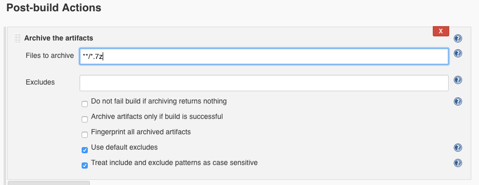

# Manage Artifacts

The default behaviour of the plugin it is not delete artifact from the S3 Bucket, so the artifacts storaged 
on the S3 Bucket would be in the S3 bucket even do you remove the build from Jenkins. 
If you want to change this behaviour you should define a couple of JVM properties.

## Delete Artifacts

In order to delete artifacts on the S3 Bucket, you would have to add the property 
`-Dio.jenkins.plugins.artifact_manager_jclouds.s3.S3BlobStoreConfig.deleteArtifacts=true` to your Jenkins JVM properties 
, if it is not set the artifacts will not be deleted from S3 Bucket when the corresponding build is deleted.

## Delete Stash

In order to delete stashes on the S3 Bucket, you would have to add the property 
`-Dio.jenkins.plugins.artifact_manager_jclouds.s3.S3BlobStoreConfig.deleteStashes=true`  to your Jenkins JVM properties
, if it is not set the stash will not be deleted from S3 when the corresponding build is deleted.

# AWS Credentials

Artifact Manager on S3 plugin needs an AWS credentials in order to access to the S3 Bucket, you can select one on the
configuration page. If you do not select any AWS credential and keep the "" dropdown on the option "IAM instance Profile/user AWS configuration"
Artifact Manager on S3 plugin would try to use the IAM instance profile credentials of the Jenkins host, or user AWS configuration (~/.aws). 


Every time you archive/unarchive or download an artifact, Jenkins will generate a temporary URL, it will be valid for an hour, 
so if you try to reuse an artifact download URL one hour later was generated, it will not be valid, 
you cannot download the artifact with that URL any more, thus you have to go back to Jenkins 
and click on the artifact to download it again. 

If you use a regular Key/Secret AWS Credentials you can set the token duration by adding the property 
`-Dio.jenkins.plugins.aws.global_configuration.CredentialsAwsGlobalConfiguration.sessionDuration` to the Jenkins JVM properties,
the default value is one hour. However if you set an IAM Role to assume on the AWS credential,
the token duration is always one hour (3600), this parameter does not change the duration in AWS Credentials Plugin settings.

# Extending Artifact Manager on S3 plugin

## Testing

Pick an AWS profile and region, then create a scratch bucket and choose a subdirectory within it for testing.
Add to your `~/.m2/settings.xml`:

```xml
    <profiles>
        <profile>
            <id>artifact-manager-s3</id>
            <activation>
                <activeByDefault>true</activeByDefault>
            </activation>
            <properties>
                <AWS_PROFILE>…</AWS_PROFILE>
                <AWS_REGION>…</AWS_REGION>
                <S3_BUCKET>…</S3_BUCKET>
                <S3_DIR>…/</S3_DIR>
            </properties>
        </profile>
    </profiles>
```

Now log in to AWS so that `~/.aws/credentials` is up to date with valid credentials, and run:

```bash
mvn clean test
```

For interactive testing, you may instead add to `~/.mavenrc` (cf. comment in MNG-6303):

```sh
export AWS_PROFILE=…
export AWS_REGION=…
```

then:

```bash
mvn hpi:run
```

Alternately, you can test against MinIO:

```bash
docker run --rm -e MINIO_ACCESS_KEY=dummy -e MINIO_SECRET_KEY=dummydummy -p 127.0.0.1:9000:9000 minio/minio server /data
```

creating AWS credentials with that access & secret key,
and enabling the `usePathStyleUrl`, `useHttp`, and `disableSessionToken` options,
and using `localhost:9000` as the `customEndpoint`.

An example pipeline for testing:

```
timestamps {
  node('uploader') {
    writeFile file: 'f', text: 'some content here'
    archiveArtifacts 'f'
  }
  node('downloader') {
    sh 'ls -l'
    unarchive mapping: [f: 'f']
    sh 'ls -l; cat f'
  }
}
```

You can also install the `log-cli` plugin, and run:

```bash
java -jar jenkins-cli.jar -s http://localhost:8080/jenkins/ tail-log io.jenkins.plugins.artifact_manager_jclouds -l ALL
```

Or to just see HTTP traffic:

```bash
java -jar jenkins-cli.jar -s http://localhost:8080/jenkins/ tail-log org.jclouds.rest.internal.InvokeHttpMethod -l FINE
```

# Troubleshooting

## No valid session credentials

The AWS credentials has to have the token attribute, Basic AWS credentials are not valid. You would see the following 
errors in the Jenkins Logs

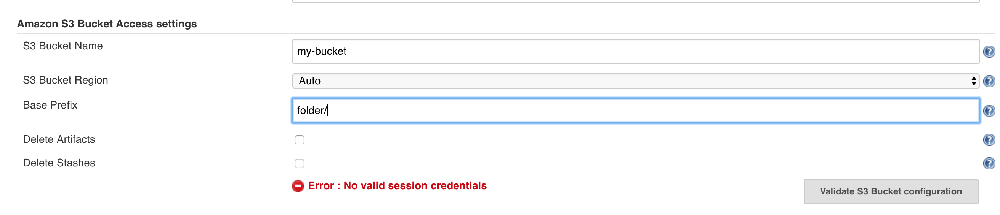
 
```
Jun 06, 2018 4:20:33 PM hudson.model.Run getArtifactsUpTo
WARNING: null
java.io.IOException: No valid session credentials
        at io.jenkins.plugins.artifact_manager_s3.S3BlobStore.getCredentialsSupplier(S3BlobStore.java:140)
        at io.jenkins.plugins.artifact_manager_s3.S3BlobStore.getContext(S3BlobStore.java:120)
        at io.jenkins.plugins.artifact_manager_jclouds.JCloudsVirtualFile.getContext(JCloudsVirtualFile.java:99)
        at io.jenkins.plugins.artifact_manager_jclouds.JCloudsVirtualFile.listStorageMetadata(JCloudsVirtualFile.java:192)
        at io.jenkins.plugins.artifact_manager_jclouds.JCloudsVirtualFile.run(JCloudsVirtualFile.java:366)
        at hudson.model.Run.getArtifactsUpTo(Run.java:1098)
        at com.cloudbees.workflow.rest.external.RunExt.createMinimal(RunExt.java:253)
```

and in Pipeline console logs

```
java.io.IOException: No valid session credentials
	at io.jenkins.plugins.artifact_manager_s3.S3BlobStore.getCredentialsSupplier(S3BlobStore.java:140)
	at io.jenkins.plugins.artifact_manager_s3.S3BlobStore.getContext(S3BlobStore.java:120)
	at io.jenkins.plugins.artifact_manager_jclouds.JCloudsArtifactManager.getContext(JCloudsArtifactManager.java:359)
	at io.jenkins.plugins.artifact_manager_jclouds.JCloudsArtifactManager.archive(JCloudsArtifactManager.java:131)
	at hudson.tasks.ArtifactArchiver.perform(ArtifactArchiver.java:235)
	at org.jenkinsci.plugins.workflow.steps.CoreStep$Execution.run(CoreStep.java:80)
	at org.jenkinsci.plugins.workflow.steps.CoreStep$Execution.run(CoreStep.java:67)
	at org.jenkinsci.plugins.workflow.steps.SynchronousNonBlockingStepExecution$1$1.call(SynchronousNonBlockingStepExecution.java:50)
	at hudson.security.ACL.impersonate(ACL.java:290)
	at org.jenkinsci.plugins.workflow.steps.SynchronousNonBlockingStepExecution$1.run(SynchronousNonBlockingStepExecution.java:47)
	at java.util.concurrent.Executors$RunnableAdapter.call(Executors.java:511)
	at java.util.concurrent.FutureTask.run(FutureTask.java:266)
	at java.util.concurrent.ThreadPoolExecutor.runWorker(ThreadPoolExecutor.java:1149)
	at java.util.concurrent.ThreadPoolExecutor$Worker.run(ThreadPoolExecutor.java:624)
	at java.lang.Thread.run(Thread.java:748)
```

Check the environment variable AWS_PROFILE, it should point to a profile with aws_session_token in `~/aws/credentials`

## Must provide an explicit region in the builder or setup environment to supply a region

In some cases the region should be specified, set the environment variable AWS_REGION to the correct region.


```
com.amazonaws.SdkClientException: Unable to find a region via the region provider chain. Must provide an explicit region in the builder or setup environment to supply a region.
	at com.amazonaws.client.builder.AwsClientBuilder.setRegion(AwsClientBuilder.java:371)
	at com.amazonaws.client.builder.AwsClientBuilder.configureMutableProperties(AwsClientBuilder.java:337)
	at com.amazonaws.client.builder.AwsSyncClientBuilder.build(AwsSyncClientBuilder.java:46)
	at io.jenkins.plugins.artifact_manager_s3.S3BlobStore.toExternalURL(S3BlobStore.java:196)
	at io.jenkins.plugins.artifact_manager_jclouds.JCloudsArtifactManager.archive(JCloudsArtifactManager.java:139)
	at hudson.tasks.ArtifactArchiver.perform(ArtifactArchiver.java:235)
	at org.jenkinsci.plugins.workflow.steps.CoreStep$Execution.run(CoreStep.java:80)
	at org.jenkinsci.plugins.workflow.steps.CoreStep$Execution.run(CoreStep.java:67)
	at org.jenkinsci.plugins.workflow.steps.SynchronousNonBlockingStepExecution$1$1.call(SynchronousNonBlockingStepExecution.java:50)
	at hudson.security.ACL.impersonate(ACL.java:290)
	at org.jenkinsci.plugins.workflow.steps.SynchronousNonBlockingStepExecution$1.run(SynchronousNonBlockingStepExecution.java:47)
	at java.util.concurrent.Executors$RunnableAdapter.call(Executors.java:511)
	at java.util.concurrent.FutureTask.run(FutureTask.java:266)
	at java.util.concurrent.ThreadPoolExecutor.runWorker(ThreadPoolExecutor.java:1149)
	at java.util.concurrent.ThreadPoolExecutor$Worker.run(ThreadPoolExecutor.java:624)
	at java.lang.Thread.run(Thread.java:748)
```

## The provided token has expired

When the AWS token is expired you will see the following error in logs, you have to refresh your AWS token.

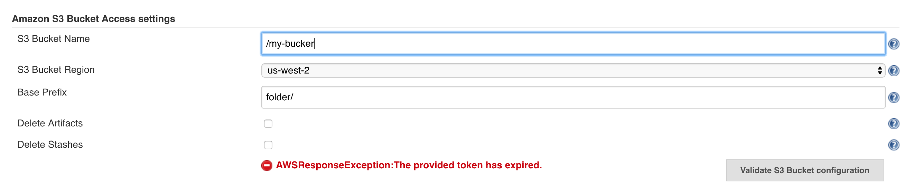

Pipeline log

```
ERROR: Failed to upload /home/user/artifact-manager-s3-plugin/work/agent/workspace/small-files/test/test-2.txt to https://my-bucket.s3.xx-xxxx-x.amazonaws.com/folder/small-files/114/artifacts/test/test-2.txt?…, response: 301 Moved Permanently, body: null
```

Jenkins log

```
Jun 06, 2018 5:40:42 PM hudson.ExpressionFactory2$JexlExpression evaluate
WARNING: Caught exception evaluating: build.getArtifactsUpTo(build.TREE_CUTOFF+1) in /jenkins/job/small-files/. Reason: org.jclouds.aws.AWSResponseException: request GET https://my-bucket.s3.amazonaws.com/?prefix=folder/small-files/78/artifacts/ HTTP/1.1 failed with code 400, error: AWSError{requestId='XXXXX', requestToken='XXXXXXX=', code='ExpiredToken', message='The provided token has expired.', context='{Token-0=FQoDYXdzEKj//////////XXXXXXXX//vPushetZVjU6wXXXXXXX=, HostId=Q6+7KaTKjXXXXXXX=}'}
org.jclouds.aws.AWSResponseException: request GET https://my-bucket.s3.amazonaws.com/?prefix=folder/small-files/78/artifacts/ HTTP/1.1 failed with code 400, error: AWSError{requestId='E64A06B2AC7FAED3', requestToken='Q6+7KaTKjqkkjjUdHgGi7/XXXXX0=', code='ExpiredToken', message='The provided token has expired.', context='{Token-0=FQoDYXdzEKj//////////XXXXXXXX//vPushetZVjU6wXXX=, HostId=Q6+7KaTXXXX=}'}
        at org.jclouds.aws.handlers.ParseAWSErrorFromXmlContent.handleError(ParseAWSErrorFromXmlContent.java:75)
        at org.jclouds.http.handlers.DelegatingErrorHandler.handleError(DelegatingErrorHandler.java:65)
        at org.jclouds.http.internal.BaseHttpCommandExecutorService.shouldContinue(BaseHttpCommandExecutorService.java:138)
        at org.jclouds.http.internal.BaseHttpCommandExecutorService.invoke(BaseHttpCommandExecutorService.java:107)
        at org.jclouds.rest.internal.InvokeHttpMethod.invoke(InvokeHttpMethod.java:91)
        at org.jclouds.rest.internal.InvokeHttpMethod.apply(InvokeHttpMethod.java:74)
        at org.jclouds.rest.internal.InvokeHttpMethod.apply(InvokeHttpMethod.java:45)
        at org.jclouds.rest.internal.DelegatesToInvocationFunction.handle(DelegatesToInvocationFunction.java:156)
        at org.jclouds.rest.internal.DelegatesToInvocationFunction.invoke(DelegatesToInvocationFunction.java:123)
        at com.sun.proxy.$Proxy141.listBucket(Unknown Source)
        at org.jclouds.s3.blobstore.S3BlobStore.list(S3BlobStore.java:177)
        at org.jclouds.blobstore.BlobStores$1$1.computeNext(BlobStores.java:86)
        at org.jclouds.blobstore.BlobStores$1$1.computeNext(BlobStores.java:73)
        at com.google.common.collect.AbstractIterator.tryToComputeNext(AbstractIterator.java:143)
        at com.google.common.collect.AbstractIterator.hasNext(AbstractIterator.java:138)
        at io.jenkins.plugins.artifact_manager_jclouds.JCloudsVirtualFile.run(JCloudsVirtualFile.java:313)
        ... 77 more

 
```

## The region 'YYYY' is wrong; expecting 'XXXX'

If the AWS login region is different than the S3 Bucket region, you would see the following errors in logs, 
to fix it, you have to force the S3 bucket region on the Plugin configuration to the `S3 Bucket region`.

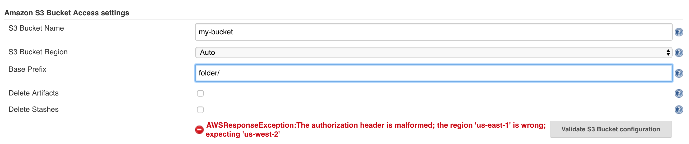

```
hudson.remoting.ProxyException: org.jclouds.aws.AWSResponseException: request GET https://my-buckets3.amazonaws.com/?prefix=folder/small-files/139/artifacts/ HTTP/1.1 failed with code 400, error: AWSError{requestId='120C24FCF0A58541', requestToken='OcrNlauC5ArwjvfQEl7esXXXXXoeMy6dZLOxK9Cxyv9QNscw7G87L/bE3b5ic=', code='AuthorizationHeaderMalformed', message='The authorization header is malformed; the region 'xx-xxxx-x' is wrong; expecting 'xx-xxxx-x'', context='{Region=xx-xxxx-x, HostId=OcrNlauC5ArwjvfQEl7esXXXXXoeMy6dZLOxK9Cxyv9QNscw7G87L/bE3b5ic=}'}
	at org.jclouds.aws.handlers.ParseAWSErrorFromXmlContent.handleError(ParseAWSErrorFromXmlContent.java:75)
	at org.jclouds.http.handlers.DelegatingErrorHandler.handleError(DelegatingErrorHandler.java:65)
	at org.jclouds.http.internal.BaseHttpCommandExecutorService.shouldContinue(BaseHttpCommandExecutorService.java:140)
	at org.jclouds.http.internal.BaseHttpCommandExecutorService.invoke(BaseHttpCommandExecutorService.java:109)
	at org.jclouds.rest.internal.InvokeHttpMethod.invoke(InvokeHttpMethod.java:90)
	at org.jclouds.rest.internal.InvokeHttpMethod.apply(InvokeHttpMethod.java:73)
	at org.jclouds.rest.internal.InvokeHttpMethod.apply(InvokeHttpMethod.java:44)
	at org.jclouds.rest.internal.DelegatesToInvocationFunction.handle(DelegatesToInvocationFunction.java:156)
	at org.jclouds.rest.internal.DelegatesToInvocationFunction.invoke(DelegatesToInvocationFunction.java:123)
	at com.sun.proxy.$Proxy128.listBucket(Unknown Source)
	at org.jclouds.s3.blobstore.S3BlobStore.list(S3BlobStore.java:175)
	at io.jenkins.plugins.artifact_manager_jclouds.JCloudsVirtualFile$PageSetIterable.advanceList(JCloudsVirtualFile.java:322)
	at io.jenkins.plugins.artifact_manager_jclouds.JCloudsVirtualFile$PageSetIterable.<init>(JCloudsVirtualFile.java:286)
	at io.jenkins.plugins.artifact_manager_jclouds.JCloudsVirtualFile.listStorageMetadata(JCloudsVirtualFile.java:192)
	at io.jenkins.plugins.artifact_manager_jclouds.JCloudsVirtualFile.run(JCloudsVirtualFile.java:366)
	at jenkins.util.VirtualFile.list(VirtualFile.java:195)
	at jenkins.util.VirtualFile.list(VirtualFile.java:178)
	at org.jenkinsci.plugins.workflow.steps.ArtifactUnarchiverStepExecution.run(ArtifactUnarchiverStepExecution.java:43)
	at org.jenkinsci.plugins.workflow.steps.ArtifactUnarchiverStepExecution.run(ArtifactUnarchiverStepExecution.java:18)
	at org.jenkinsci.plugins.workflow.steps.SynchronousNonBlockingStepExecution$1$1.call(SynchronousNonBlockingStepExecution.java:50)
	at hudson.security.ACL.impersonate(ACL.java:290)
	at org.jenkinsci.plugins.workflow.steps.SynchronousNonBlockingStepExecution$1.run(SynchronousNonBlockingStepExecution.java:47)
	at java.util.concurrent.Executors$RunnableAdapter.call(Executors.java:511)
	at java.util.concurrent.FutureTask.run(FutureTask.java:266)
	at java.util.concurrent.ThreadPoolExecutor.runWorker(ThreadPoolExecutor.java:1149)
	at java.util.concurrent.ThreadPoolExecutor$Worker.run(ThreadPoolExecutor.java:624)
	at java.lang.Thread.run(Thread.java:748)
```

## Empty S3 Bucket name

The configuration will warning you about you are trying to save a empty bucket name even do you save the configuration, 
and you try to archive artifacts, you would see the following errors. To fix it you have to set a proper S3 Bucket name.


Pipeline log
```
ERROR: Failed to upload /home/user/artifact-manager-s3-plugin/work/agent/workspace/small-files@tmp/stash2772898641820040408.tgz to https://s3.xx-xxxx-x.amazonaws.com/folder/small-files/159/stashes/stuff.tgz?…, response: 301 Moved Permanently, body: null
```

Jenkins log
```
Jun 06, 2018 6:23:04 PM hudson.ExpressionFactory2$JexlExpression evaluate
WARNING: Caught exception evaluating: build.getArtifactsUpTo(build.TREE_CUTOFF+1) in /jenkins/job/small-files/. Reason: java.lang.IllegalArgumentException: Validation on '[java.lang.String arg0, [Lorg.jclouds.s3.options.ListBucketOptions; arg1]' didn't pass:
 Reason: Object '' doesn't match S3 bucket bucket naming convention. Reason: Can't be less than 3 characters. For more info, please refer to https://docs.aws.amazon.com/AmazonS3/latest/dev/BucketRestrictions.html.
java.lang.IllegalArgumentException: Validation on '[java.lang.String arg0, [Lorg.jclouds.s3.options.ListBucketOptions; arg1]' didn't pass:
 Reason: Object '' doesn't match S3 bucket bucket naming convention. Reason: Can't be less than 3 characters. For more info, please refer to https://docs.aws.amazon.com/AmazonS3/latest/dev/BucketRestrictions.html.
        at org.jclouds.rest.InputParamValidator.validateMethodParametersOrThrow(InputParamValidator.java:72)
        at org.jclouds.rest.internal.RestAnnotationProcessor.apply(RestAnnotationProcessor.java:193)
        at org.jclouds.rest.internal.RestAnnotationProcessor.apply(RestAnnotationProcessor.java:137)
        at org.jclouds.rest.internal.InvokeHttpMethod.toCommand(InvokeHttpMethod.java:188)
        at org.jclouds.rest.internal.InvokeHttpMethod.invoke(InvokeHttpMethod.java:84)
        at org.jclouds.rest.internal.InvokeHttpMethod.apply(InvokeHttpMethod.java:73)
        at org.jclouds.rest.internal.InvokeHttpMethod.apply(InvokeHttpMethod.java:44)
        at org.jclouds.rest.internal.DelegatesToInvocationFunction.handle(DelegatesToInvocationFunction.java:156)
        at org.jclouds.rest.internal.DelegatesToInvocationFunction.invoke(DelegatesToInvocationFunction.java:123)
        at com.sun.proxy.$Proxy133.listBucket(Unknown Source)
        at org.jclouds.s3.blobstore.S3BlobStore.list(S3BlobStore.java:175)
        at io.jenkins.plugins.artifact_manager_jclouds.JCloudsVirtualFile$PageSetIterable.advanceList(JCloudsVirtualFile.java:322)
        at io.jenkins.plugins.artifact_manager_jclouds.JCloudsVirtualFile$PageSetIterable.<init>(JCloudsVirtualFile.java:286)
        at io.jenkins.plugins.artifact_manager_jclouds.JCloudsVirtualFile.listStorageMetadata(JCloudsVirtualFile.java:192)
        at io.jenkins.plugins.artifact_manager_jclouds.JCloudsVirtualFile.run(JCloudsVirtualFile.java:366)
        at hudson.model.Run.getArtifactsUpTo(Run.java:1098)
        at sun.reflect.NativeMethodAccessorImpl.invoke0(Native Method)
        at sun.reflect.NativeMethodAccessorImpl.invoke(NativeMethodAccessorImpl.java:62)
        at sun.reflect.DelegatingMethodAccessorImpl.invoke(DelegatingMethodAccessorImpl.java:43)
        at java.lang.reflect.Method.invoke(Method.java:498)
...
        at org.eclipse.jetty.server.handler.HandlerWrapper.handle(HandlerWrapper.java:132)
        at org.eclipse.jetty.server.Server.handle(Server.java:564)
        at org.eclipse.jetty.server.HttpChannel.handle(HttpChannel.java:317)
        at org.eclipse.jetty.server.HttpConnection.onFillable(HttpConnection.java:251)
        at org.eclipse.jetty.io.AbstractConnection$ReadCallback.succeeded(AbstractConnection.java:279)
        at org.eclipse.jetty.io.FillInterest.fillable(FillInterest.java:110)
        at org.eclipse.jetty.io.ChannelEndPoint$2.run(ChannelEndPoint.java:124)
        at org.eclipse.jetty.util.thread.Invocable.invokePreferred(Invocable.java:128)
        at org.eclipse.jetty.util.thread.Invocable$InvocableExecutor.invoke(Invocable.java:222)
        at org.eclipse.jetty.util.thread.strategy.EatWhatYouKill.doProduce(EatWhatYouKill.java:294)
        at org.eclipse.jetty.util.thread.strategy.EatWhatYouKill.run(EatWhatYouKill.java:199)
        at org.eclipse.jetty.util.thread.QueuedThreadPool.runJob(QueuedThreadPool.java:672)
        at org.eclipse.jetty.util.thread.QueuedThreadPool$2.run(QueuedThreadPool.java:590)
        at java.lang.Thread.run(Thread.java:748)
Caused by: java.lang.IllegalArgumentException: Object '' doesn't match S3 bucket bucket naming convention. Reason: Can't be less than 3 characters. For more info, please refer to https://docs.aws.amazon.com/AmazonS3/latest/dev/BucketRestrictions.html
        at org.jclouds.s3.predicates.validators.BucketNameValidator.exception(BucketNameValidator.java:59)
        at org.jclouds.s3.predicates.validators.BucketNameValidator.validate(BucketNameValidator.java:50)
        at org.jclouds.aws.s3.predicates.validators.AWSS3BucketNameValidator.validate(AWSS3BucketNameValidator.java:50)
        at org.jclouds.aws.s3.predicates.validators.AWSS3BucketNameValidator.validate(AWSS3BucketNameValidator.java:32)
        at org.jclouds.predicates.Validator.apply(Validator.java:37)
        at org.jclouds.rest.InputParamValidator.runPredicatesAgainstArg(InputParamValidator.java:128)
        at org.jclouds.rest.InputParamValidator.performParameterValidation(InputParamValidator.java:112)
        at org.jclouds.rest.InputParamValidator.validateMethodParametersOrThrow(InputParamValidator.java:70)
        ... 130 more
```

## The specified bucket does not exist

If you set an unexistent S3 Bucket you would see the following errors in logs, 
to fix it set a proper S3 Bucket name in the Plugin configuration.

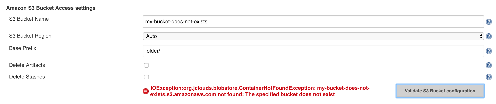

```
NFO: small-files #170 completed: FAILURE
Jun 07, 2018 2:01:40 PM hudson.model.Run getArtifactsUpTo
WARNING: null
java.io.IOException: org.jclouds.blobstore.ContainerNotFoundException: borken.s3-xx-xxxx-x.amazonaws.com not found: The specified bucket does not exist
        at io.jenkins.plugins.artifact_manager_jclouds.JCloudsVirtualFile.run(JCloudsVirtualFile.java:384)
        at hudson.model.Run.getArtifactsUpTo(Run.java:1098)
        at sun.reflect.NativeMethodAccessorImpl.invoke0(Native Method)
        at sun.reflect.NativeMethodAccessorImpl.invoke(NativeMethodAccessorImpl.java:62)
        at sun.reflect.DelegatingMethodAccessorImpl.invoke(DelegatingMethodAccessorImpl.java:43)
        at java.lang.reflect.Method.invoke(Method.java:498)
        at org.apache.commons.jexl.util.introspection.UberspectImpl$VelMethodImpl.invoke(UberspectImpl.java:258)
...
        at org.eclipse.jetty.server.Server.handle(Server.java:564)
        at org.eclipse.jetty.server.HttpChannel.handle(HttpChannel.java:317)
        at org.eclipse.jetty.server.HttpConnection.onFillable(HttpConnection.java:251)
        at org.eclipse.jetty.io.AbstractConnection$ReadCallback.succeeded(AbstractConnection.java:279)
        at org.eclipse.jetty.io.FillInterest.fillable(FillInterest.java:110)
        at org.eclipse.jetty.io.ChannelEndPoint$2.run(ChannelEndPoint.java:124)
        at org.eclipse.jetty.util.thread.Invocable.invokePreferred(Invocable.java:128)
        at org.eclipse.jetty.util.thread.Invocable$InvocableExecutor.invoke(Invocable.java:222)
        at org.eclipse.jetty.util.thread.strategy.EatWhatYouKill.doProduce(EatWhatYouKill.java:294)
        at org.eclipse.jetty.util.thread.strategy.EatWhatYouKill.run(EatWhatYouKill.java:199)
        at org.eclipse.jetty.util.thread.QueuedThreadPool.runJob(QueuedThreadPool.java:672)
        at org.eclipse.jetty.util.thread.QueuedThreadPool$2.run(QueuedThreadPool.java:590)
        at java.lang.Thread.run(Thread.java:748)
Caused by: org.jclouds.blobstore.ContainerNotFoundException: borken.s3-xx-xxxx-x.amazonaws.com not found: The specified bucket does not exist
        at org.jclouds.s3.handlers.ParseS3ErrorFromXmlContent.refineException(ParseS3ErrorFromXmlContent.java:81)
        at org.jclouds.aws.handlers.ParseAWSErrorFromXmlContent.handleError(ParseAWSErrorFromXmlContent.java:89)
        at org.jclouds.http.handlers.DelegatingErrorHandler.handleError(DelegatingErrorHandler.java:65)
        at org.jclouds.http.internal.BaseHttpCommandExecutorService.shouldContinue(BaseHttpCommandExecutorService.java:140)
        at org.jclouds.http.internal.BaseHttpCommandExecutorService.invoke(BaseHttpCommandExecutorService.java:109)
        at org.jclouds.rest.internal.InvokeHttpMethod.invoke(InvokeHttpMethod.java:90)
        at org.jclouds.rest.internal.InvokeHttpMethod.apply(InvokeHttpMethod.java:73)
        at org.jclouds.rest.internal.InvokeHttpMethod.apply(InvokeHttpMethod.java:44)
        at org.jclouds.rest.internal.DelegatesToInvocationFunction.handle(DelegatesToInvocationFunction.java:156)
        at org.jclouds.rest.internal.DelegatesToInvocationFunction.invoke(DelegatesToInvocationFunction.java:123)
        at com.sun.proxy.$Proxy129.listBucket(Unknown Source)
        at org.jclouds.s3.blobstore.S3BlobStore.list(S3BlobStore.java:175)
        at io.jenkins.plugins.artifact_manager_jclouds.JCloudsVirtualFile$PageSetIterable.advanceList(JCloudsVirtualFile.java:329)
        at io.jenkins.plugins.artifact_manager_jclouds.JCloudsVirtualFile$PageSetIterable.<init>(JCloudsVirtualFile.java:293)
        at io.jenkins.plugins.artifact_manager_jclouds.JCloudsVirtualFile.listStorageMetadata(JCloudsVirtualFile.java:192)
        at io.jenkins.plugins.artifact_manager_jclouds.JCloudsVirtualFile.run(JCloudsVirtualFile.java:374)
        ... 116 more
```

## Network outages

The following message of error appears when the host it is not accessible meanwhile we are sending/getting data from S3.

```
hudson.remoting.ProxyException: java.net.SocketException: Unexpected end of file from server
	at sun.net.www.http.HttpClient.parseHTTPHeader(HttpClient.java:851)
	at sun.net.www.http.HttpClient.parseHTTP(HttpClient.java:678)
	at sun.net.www.protocol.http.HttpURLConnection.doTunneling(HttpURLConnection.java:2055)
	at sun.net.www.protocol.https.AbstractDelegateHttpsURLConnection.connect(AbstractDelegateHttpsURLConnection.java:183)
	at sun.net.www.protocol.http.HttpURLConnection.getInputStream0(HttpURLConnection.java:1564)
	at sun.net.www.protocol.http.HttpURLConnection.getInputStream(HttpURLConnection.java:1492)
	at sun.net.www.protocol.https.HttpsURLConnectionImpl.getInputStream(HttpsURLConnectionImpl.java:263)
	at org.jclouds.http.internal.JavaUrlHttpCommandExecutorService.invoke(JavaUrlHttpCommandExecutorService.java:97)
Caused: hudson.remoting.ProxyException: java.net.SocketException: Unexpected end of file from server
	at sun.reflect.GeneratedConstructorAccessor152.newInstance(Unknown Source)
	at sun.reflect.DelegatingConstructorAccessorImpl.newInstance(DelegatingConstructorAccessorImpl.java:45)
	at java.lang.reflect.Constructor.newInstance(Constructor.java:423)
	at sun.net.www.protocol.http.HttpURLConnection$10.run(HttpURLConnection.java:1944)
	at sun.net.www.protocol.http.HttpURLConnection$10.run(HttpURLConnection.java:1939)
	at java.security.AccessController.doPrivileged(Native Method)
	at sun.net.www.protocol.http.HttpURLConnection.getChainedException(HttpURLConnection.java:1938)
	at sun.net.www.protocol.http.HttpURLConnection.getInputStream0(HttpURLConnection.java:1508)
	at sun.net.www.protocol.http.HttpURLConnection.getInputStream(HttpURLConnection.java:1492)
	at java.net.HttpURLConnection.getResponseCode(HttpURLConnection.java:480)
	at sun.net.www.protocol.https.HttpsURLConnectionImpl.getResponseCode(HttpsURLConnectionImpl.java:347)
	at org.jclouds.http.internal.JavaUrlHttpCommandExecutorService.invoke(JavaUrlHttpCommandExecutorService.java:105)
	at org.jclouds.http.internal.JavaUrlHttpCommandExecutorService.invoke(JavaUrlHttpCommandExecutorService.java:65)
	at org.jclouds.http.internal.BaseHttpCommandExecutorService.invoke(BaseHttpCommandExecutorService.java:100)
Caused: hudson.remoting.ProxyException: org.jclouds.http.HttpResponseException: Unexpected end of file from server connecting to GET https://my-bucket-s3-xx-xxxx-x.amazonaws.com/?prefix=folder/small-files/174/artifacts/ HTTP/1.1
	at org.jclouds.http.internal.BaseHttpCommandExecutorService.invoke(BaseHttpCommandExecutorService.java:122)
	at org.jclouds.rest.internal.InvokeHttpMethod.invoke(InvokeHttpMethod.java:90)
	at org.jclouds.rest.internal.InvokeHttpMethod.apply(InvokeHttpMethod.java:73)
	at org.jclouds.rest.internal.InvokeHttpMethod.apply(InvokeHttpMethod.java:44)
	at org.jclouds.rest.internal.DelegatesToInvocationFunction.handle(DelegatesToInvocationFunction.java:156)
	at org.jclouds.rest.internal.DelegatesToInvocationFunction.invoke(DelegatesToInvocationFunction.java:123)
	at com.sun.proxy.$Proxy124.listBucket(Unknown Source)
	at org.jclouds.s3.blobstore.S3BlobStore.list(S3BlobStore.java:175)
	at io.jenkins.plugins.artifact_manager_jclouds.JCloudsVirtualFile$PageSetIterable.advanceList(JCloudsVirtualFile.java:329)
	at io.jenkins.plugins.artifact_manager_jclouds.JCloudsVirtualFile$PageSetIterable.<init>(JCloudsVirtualFile.java:293)
	at io.jenkins.plugins.artifact_manager_jclouds.JCloudsVirtualFile.listStorageMetadata(JCloudsVirtualFile.java:192)
	at io.jenkins.plugins.artifact_manager_jclouds.JCloudsVirtualFile.run(JCloudsVirtualFile.java:374)
Caused: hudson.remoting.ProxyException: java.io.IOException: org.jclouds.http.HttpResponseException: Unexpected end of file from server connecting to GET https://my-bucket-s3-xx-xxxx-x.amazonaws.com/?prefix=folder/small-files/174/artifacts/ HTTP/1.1
	at io.jenkins.plugins.artifact_manager_jclouds.JCloudsVirtualFile.run(JCloudsVirtualFile.java:384)
	at jenkins.util.VirtualFile.list(VirtualFile.java:195)
	at jenkins.util.VirtualFile.list(VirtualFile.java:178)
	at org.jenkinsci.plugins.workflow.steps.ArtifactUnarchiverStepExecution.run(ArtifactUnarchiverStepExecution.java:46)
	at org.jenkinsci.plugins.workflow.steps.ArtifactUnarchiverStepExecution.run(ArtifactUnarchiverStepExecution.java:20)
	at org.jenkinsci.plugins.workflow.steps.SynchronousNonBlockingStepExecution$1$1.call(SynchronousNonBlockingStepExecution.java:50)
	at hudson.security.ACL.impersonate(ACL.java:290)
	at org.jenkinsci.plugins.workflow.steps.SynchronousNonBlockingStepExecution$1.run(SynchronousNonBlockingStepExecution.java:47)
	at java.util.concurrent.Executors$RunnableAdapter.call(Executors.java:511)
	at java.util.concurrent.FutureTask.run(FutureTask.java:266)
	at java.util.concurrent.ThreadPoolExecutor.runWorker(ThreadPoolExecutor.java:1149)
	at java.util.concurrent.ThreadPoolExecutor$Worker.run(ThreadPoolExecutor.java:624)
	at java.lang.Thread.run(Thread.java:748)
```

```
Jun 07, 2018 4:51:20 PM org.jclouds.logging.jdk.JDKLogger logError
SEVERE: Cannot retry after server error, command has exceeded retry limit 5: [method=org.jclouds.aws.s3.AWSS3Client.public abstract org.jclouds.s3.domain.ListBucketResponse org.jclouds.s3.S3Client.listBucket(java.lang.String,org.jclouds.s3.options.ListBucketOptions[])[mybucket-s3, [Lorg.jclouds.s3.options.ListBucketOptions;@1901a532], request=GET https://my-bucket-s3-xx-xxxx-x.amazonaws.com/?prefix=folder/big-file/12/artifacts/ HTTP/1.1]
Jun 07, 2018 4:51:20 PM hudson.model.Run getArtifactsUpTo
WARNING: null
```

```
11:53:58 Archiving artifacts
11:54:54 Retrying upload after: java.net.SocketException: Broken pipe (Write failed)

...
12:00:02 Retrying upload after: java.net.SocketException: Broken pipe (Write failed)
12:01:06 Retrying upload after: java.net.SocketException: Broken pipe (Write failed)
```

## Member must have length greater than or equal to 20

If you use an invalid IAM Role ID on your credentials, you would see the following error, 
you have to set a proper ARN specifying the IAM role to assume. The format should be something like: 
"arn:aws:iam::123456789012:role/MyIAMRoleName".


```
Jun 15, 2018 12:01:16 PM hudson.model.Run getArtifactsUpTo
WARNING: null
java.io.IOException: com.amazonaws.services.securitytoken.model.AWSSecurityTokenServiceException: 1 validation error detected: Value 'MyIAMRoleName' at 'roleArn' failed to satisfy constraint: Member must have length greater than or equal to 20 (Service: AWSSecurityTokenService; Status Code: 400; Error Code: ValidationError; Request ID: XXXXXX)
        at io.jenkins.plugins.artifact_manager_jclouds.JCloudsVirtualFile.run(JCloudsVirtualFile.java:321)
        at hudson.model.Run.getArtifactsUpTo(Run.java:1098)
...
        at org.eclipse.jetty.util.thread.QueuedThreadPool$2.run(QueuedThreadPool.java:590)
        at java.lang.Thread.run(Thread.java:748)
Caused by: com.amazonaws.services.securitytoken.model.AWSSecurityTokenServiceException: 1 validation error detected: Value 'MyIAMRoleName' at 'roleArn' failed to satisfy constraint: Member must have length greater than or equal to 20 (Service: AWSSecurityTokenService; Status Code: 400; Error Code: ValidationError; Request ID: XXXXXX)
        at com.amazonaws.http.AmazonHttpClient$RequestExecutor.handleErrorResponse(AmazonHttpClient.java:1632)
        at com.amazonaws.http.AmazonHttpClient$RequestExecutor.executeOneRequest(AmazonHttpClient.java:1304)
        at com.amazonaws.http.AmazonHttpClient$RequestExecutor.executeHelper(AmazonHttpClient.java:1058)
        at com.amazonaws.http.AmazonHttpClient$RequestExecutor.doExecute(AmazonHttpClient.java:743)
        at com.amazonaws.http.AmazonHttpClient$RequestExecutor.executeWithTimer(AmazonHttpClient.java:717)
        at com.amazonaws.http.AmazonHttpClient$RequestExecutor.execute(AmazonHttpClient.java:699)
        at com.amazonaws.http.AmazonHttpClient$RequestExecutor.access$500(AmazonHttpClient.java:667)
        at com.amazonaws.http.AmazonHttpClient$RequestExecutionBuilderImpl.execute(AmazonHttpClient.java:649)
        at com.amazonaws.http.AmazonHttpClient.execute(AmazonHttpClient.java:513)
        at com.amazonaws.services.securitytoken.AWSSecurityTokenServiceClient.doInvoke(AWSSecurityTokenServiceClient.java:1307)
        at com.amazonaws.services.securitytoken.AWSSecurityTokenServiceClient.invoke(AWSSecurityTokenServiceClient.java:1283)
        at com.amazonaws.services.securitytoken.AWSSecurityTokenServiceClient.executeAssumeRole(AWSSecurityTokenServiceClient.java:466)
        at com.amazonaws.services.securitytoken.AWSSecurityTokenServiceClient.assumeRole(AWSSecurityTokenServiceClient.java:442)
        at com.cloudbees.jenkins.plugins.awscredentials.AWSCredentialsImpl.getCredentials(AWSCredentialsImpl.java:124)
        at io.jenkins.plugins.artifact_manager_jclouds.s3.S3BlobStore.sessionCredentialsFromKeyAndSecret(S3BlobStore.java:145)
        at io.jenkins.plugins.artifact_manager_jclouds.s3.S3BlobStore.getCredentialsSupplier(S3BlobStore.java:186)
        at io.jenkins.plugins.artifact_manager_jclouds.s3.S3BlobStore.getContext(S3BlobStore.java:126)
        at io.jenkins.plugins.artifact_manager_jclouds.JCloudsVirtualFile.getContext(JCloudsVirtualFile.java:96)
        at io.jenkins.plugins.artifact_manager_jclouds.JCloudsVirtualFile.listStorageMetadata(JCloudsVirtualFile.java:190)
        at io.jenkins.plugins.artifact_manager_jclouds.JCloudsVirtualFile.run(JCloudsVirtualFile.java:313)
        ... 77 more

```

## User: arn:aws:iam::XXXXXX:user/people/myUser is not authorized to perform: sts:AssumeRole on resource: arn:aws:iam::XXXXXXX:role/my-role

If you see the following error, your user would not assume the IAM Role that you set on your Jenkins AWS Credentials. 
Check that your user can assume that IAM Role in AWS Console.

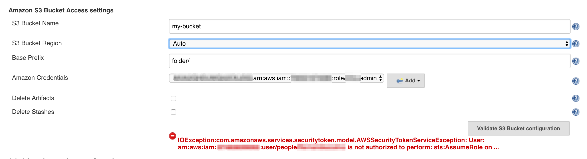

```
Jun 15, 2018 12:00:15 PM hudson.model.Run getArtifactsUpTo
WARNING: null
java.io.IOException: com.amazonaws.services.securitytoken.model.AWSSecurityTokenServiceException: User: arn:aws:iam::XXXXXX:user/people/myUser is not authorized to perform: sts:AssumeRole on resource: arn:aws:iam::XXXXXXX:role/my-role (Service: AWSSecurityTokenService; Status Code: 403; Error Code: AccessDenied; Request ID: XXXXXX)
        at io.jenkins.plugins.artifact_manager_jclouds.JCloudsVirtualFile.run(JCloudsVirtualFile.java:321)
        at hudson.model.Run.getArtifactsUpTo(Run.java:1098)
        at com.cloudbees.workflow.rest.external.RunExt.createMinimal(RunExt.java:253)
        at com.cloudbees.workflow.rest.external.RunExt.createNew(RunExt.java:317)
        at com.cloudbees.workflow.rest.external.RunExt.create(RunExt.java:309)
        at com.cloudbees.workflow.rest.external.JobExt.create(JobExt.java:131)
        at com.cloudbees.workflow.rest.endpoints.JobAPI.doRuns(JobAPI.java:69)
        at java.lang.invoke.MethodHandle.invokeWithArguments(MethodHandle.java:627)
...
        at org.eclipse.jetty.util.thread.QueuedThreadPool$2.run(QueuedThreadPool.java:590)
        at java.lang.Thread.run(Thread.java:748)
Caused by: com.amazonaws.services.securitytoken.model.AWSSecurityTokenServiceException: User: arn:aws:iam::XXXXXX:user/people/myUser is not authorized to perform: sts:AssumeRole on resource: arn:aws:iam::XXXXXXX:role/my-role (Service: AWSSecurityTokenService; Status Code: 403; Error Code: AccessDenied; Request ID: XXXXXX)
        at com.amazonaws.http.AmazonHttpClient$RequestExecutor.handleErrorResponse(AmazonHttpClient.java:1632)
        at com.amazonaws.http.AmazonHttpClient$RequestExecutor.executeOneRequest(AmazonHttpClient.java:1304)
        at com.amazonaws.http.AmazonHttpClient$RequestExecutor.executeHelper(AmazonHttpClient.java:1058)
        at com.amazonaws.http.AmazonHttpClient$RequestExecutor.doExecute(AmazonHttpClient.java:743)
        at com.amazonaws.http.AmazonHttpClient$RequestExecutor.executeWithTimer(AmazonHttpClient.java:717)
        at com.amazonaws.http.AmazonHttpClient$RequestExecutor.execute(AmazonHttpClient.java:699)
        at com.amazonaws.http.AmazonHttpClient$RequestExecutor.access$500(AmazonHttpClient.java:667)
        at com.amazonaws.http.AmazonHttpClient$RequestExecutionBuilderImpl.execute(AmazonHttpClient.java:649)
        at com.amazonaws.http.AmazonHttpClient.execute(AmazonHttpClient.java:513)
        at com.amazonaws.services.securitytoken.AWSSecurityTokenServiceClient.doInvoke(AWSSecurityTokenServiceClient.java:1307)
        at com.amazonaws.services.securitytoken.AWSSecurityTokenServiceClient.invoke(AWSSecurityTokenServiceClient.java:1283)
        at com.amazonaws.services.securitytoken.AWSSecurityTokenServiceClient.executeAssumeRole(AWSSecurityTokenServiceClient.java:466)
        at com.amazonaws.services.securitytoken.AWSSecurityTokenServiceClient.assumeRole(AWSSecurityTokenServiceClient.java:442)
        at com.cloudbees.jenkins.plugins.awscredentials.AWSCredentialsImpl.getCredentials(AWSCredentialsImpl.java:124)
        at io.jenkins.plugins.artifact_manager_jclouds.s3.S3BlobStore.sessionCredentialsFromKeyAndSecret(S3BlobStore.java:145)
        at io.jenkins.plugins.artifact_manager_jclouds.s3.S3BlobStore.getCredentialsSupplier(S3BlobStore.java:186)
        at io.jenkins.plugins.artifact_manager_jclouds.s3.S3BlobStore.getContext(S3BlobStore.java:126)
        at io.jenkins.plugins.artifact_manager_jclouds.JCloudsVirtualFile.getContext(JCloudsVirtualFile.java:96)
        at io.jenkins.plugins.artifact_manager_jclouds.JCloudsVirtualFile.listStorageMetadata(JCloudsVirtualFile.java:190)
        at io.jenkins.plugins.artifact_manager_jclouds.JCloudsVirtualFile.run(JCloudsVirtualFile.java:313)
        ... 77 more

```

## Unable to find a region via the region provider chain. Must provide an explicit region in the builder or setup environment to supply a region. 

There is no user AWS configuration (~/.aws), and there is not AWS credential configured. You need a user AWS configuration, 
or you have to configure an AWS credential in Jenkins. 

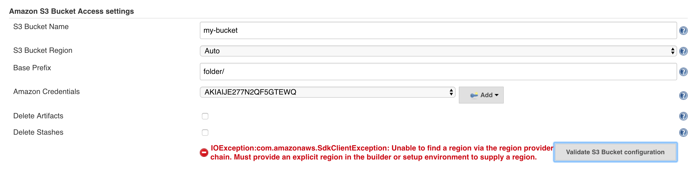

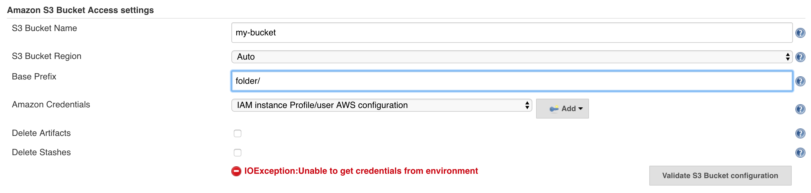
 
```
com.amazonaws.SdkClientException: Unable to find a region via the region provider chain. Must provide an explicit region in the builder or setup environment to supply a region.
	at com.amazonaws.client.builder.AwsClientBuilder.setRegion(AwsClientBuilder.java:371)
	at com.amazonaws.client.builder.AwsClientBuilder.configureMutableProperties(AwsClientBuilder.java:337)
	at com.amazonaws.client.builder.AwsSyncClientBuilder.build(AwsSyncClientBuilder.java:46)
	at io.jenkins.plugins.artifact_manager_jclouds.s3.S3BlobStore.sessionCredentialsFromKeyAndSecret(S3BlobStore.java:154)
	at io.jenkins.plugins.artifact_manager_jclouds.s3.S3BlobStore.getCredentialsSupplier(S3BlobStore.java:187)
	at io.jenkins.plugins.artifact_manager_jclouds.s3.S3BlobStore.getContext(S3BlobStore.java:127)
	at io.jenkins.plugins.artifact_manager_jclouds.JCloudsArtifactManager.getContext(JCloudsArtifactManager.java:316)
	at io.jenkins.plugins.artifact_manager_jclouds.JCloudsArtifactManager.archive(JCloudsArtifactManager.java:116)
	at hudson.tasks.ArtifactArchiver.perform(ArtifactArchiver.java:235)
	at org.jenkinsci.plugins.workflow.steps.CoreStep$Execution.run(CoreStep.java:80)
	at org.jenkinsci.plugins.workflow.steps.CoreStep$Execution.run(CoreStep.java:67)
	at org.jenkinsci.plugins.workflow.steps.SynchronousNonBlockingStepExecution$1$1.call(SynchronousNonBlockingStepExecution.java:50)
	at hudson.security.ACL.impersonate(ACL.java:290)
	at org.jenkinsci.plugins.workflow.steps.SynchronousNonBlockingStepExecution$1.run(SynchronousNonBlockingStepExecution.java:47)
	at java.util.concurrent.Executors$RunnableAdapter.call(Executors.java:511)
	at java.util.concurrent.FutureTask.run(FutureTask.java:266)
	at java.util.concurrent.ThreadPoolExecutor.runWorker(ThreadPoolExecutor.java:1149)
	at java.util.concurrent.ThreadPoolExecutor$Worker.run(ThreadPoolExecutor.java:624)
	at java.lang.Thread.run(Thread.java:748)
```

```
java.lang.NullPointerException
	at com.amazonaws.auth.AbstractAWSSigner.sanitizeCredentials(AbstractAWSSigner.java:411)
	at com.amazonaws.auth.AWS4Signer.presignRequest(AWS4Signer.java:273)
	at com.amazonaws.services.s3.AmazonS3Client.generatePresignedUrl(AmazonS3Client.java:3009)
	at com.amazonaws.services.s3.AmazonS3Client.generatePresignedUrl(AmazonS3Client.java:2945)
	at io.jenkins.plugins.artifact_manager_jclouds.s3.S3BlobStore.toExternalURL(S3BlobStore.java:246)
	at io.jenkins.plugins.artifact_manager_jclouds.JCloudsArtifactManager.archive(JCloudsArtifactManager.java:124)
	at hudson.tasks.ArtifactArchiver.perform(ArtifactArchiver.java:235)
	at org.jenkinsci.plugins.workflow.steps.CoreStep$Execution.run(CoreStep.java:80)
	at org.jenkinsci.plugins.workflow.steps.CoreStep$Execution.run(CoreStep.java:67)
	at org.jenkinsci.plugins.workflow.steps.SynchronousNonBlockingStepExecution$1$1.call(SynchronousNonBlockingStepExecution.java:50)
	at hudson.security.ACL.impersonate(ACL.java:290)
	at org.jenkinsci.plugins.workflow.steps.SynchronousNonBlockingStepExecution$1.run(SynchronousNonBlockingStepExecution.java:47)
	at java.util.concurrent.Executors$RunnableAdapter.call(Executors.java:511)
	at java.util.concurrent.FutureTask.run(FutureTask.java:266)
	at java.util.concurrent.ThreadPoolExecutor.runWorker(ThreadPoolExecutor.java:1149)
	at java.util.concurrent.ThreadPoolExecutor$Worker.run(ThreadPoolExecutor.java:624)
	at java.lang.Thread.run(Thread.java:748)
```

# Changelog

## 1.7 and newer

See [GitHub releases](https://github.com/jenkinsci/artifact-manager-s3-plugin/releases).

## 1.6 (2019-05-23)

-   Extend 1.5’s flush fix to some error-handling cases.

## 1.5 (2019-05-06)

-   Properly flush listeners from all remote callables
    ([commit](https://github.com/jenkinsci/artifact-manager-s3-plugin/pull/92/commits/9da949541b8a9c5cb36a290fa8a4f91f92132b6f){.external-link})
-   [PR
    \#92](https://github.com/jenkinsci/artifact-manager-s3-plugin/pull/92){.external-link}
    - Internal: Update dependencies to support testing of the plugin
    with Java 11

## 1.4 (2019-04-04)

-   Following up metadata changes in 1.3 to make the plugin work on
    Java 11. Now requires Jenkins 2.164.x or newer.

## 1.3 (2019-03-27)

-   Flush a message printed from the agent side, to work better
    with [JEP-210](https://jenkins.io/jep/210){.external-link}.
-   Metadata changes for `plugin-compat-tester`.

## 1.2 (2018-11-06)

-   [
    JENKINS-50591](https://issues.jenkins-ci.org/browse/JENKINS-50591){.jira-issue-key}
    - Getting issue details... STATUS  /  [
    JENKINS-52151](https://issues.jenkins-ci.org/browse/JENKINS-52151){.jira-issue-key}
    - Getting issue details... STATUS  Picking
    up <https://jira.apache.org/jira/browse/JCLOUDS-1401> and <https://jira.apache.org/jira/browse/JCLOUDS-1433> to
    address most problems with special characters in artifact names.
-   Added form validation for bucket location.

## 1.1 (2018 Jul 17)

-   Using [AWS Global Configuration
    Plugin](https://wiki.jenkins.io/display/JENKINS/AWS+Global+Configuration+Plugin)
    for configuration.
-   [
    JENKINS-52304](https://issues.jenkins-ci.org/browse/JENKINS-52304){.jira-issue-key}
    - Getting issue details... STATUS
-   [
    JENKINS-52361](https://issues.jenkins-ci.org/browse/JENKINS-52361){.jira-issue-key}
    - Getting issue details... STATUS
-   test for  [
    JENKINS-52151](https://issues.jenkins-ci.org/browse/JENKINS-52151){.jira-issue-key}
    - Getting issue details... STATUS  and [
    JENKINS-50591](https://issues.jenkins-ci.org/browse/JENKINS-50591){.jira-issue-key}
    - Getting issue details... STATUS ; actual fix is pending a new
    jclouds release
-   [
    JENKINS-52254](https://issues.jenkins-ci.org/browse/JENKINS-52254){.jira-issue-key}
    - Getting issue details... STATUS
-   [
    JENKINS-52250](https://issues.jenkins-ci.org/browse/JENKINS-52250){.jira-issue-key}
    - Getting issue details... STATUS
-   Ability to create the S3 bucket from the configuration page.

## 1.0 (2018 Jun 26)

No code changes since beta 2, only metadata.

## 1.0-beta-2 (2018 Jun 21)

-   [
    JENKINS-51396](https://issues.jenkins-ci.org/browse/JENKINS-51396){.jira-issue-key}
    - Getting issue details... STATUS

## 1.0-beta-1 (2018 Jun 19)

Initial release to experimental update center.
